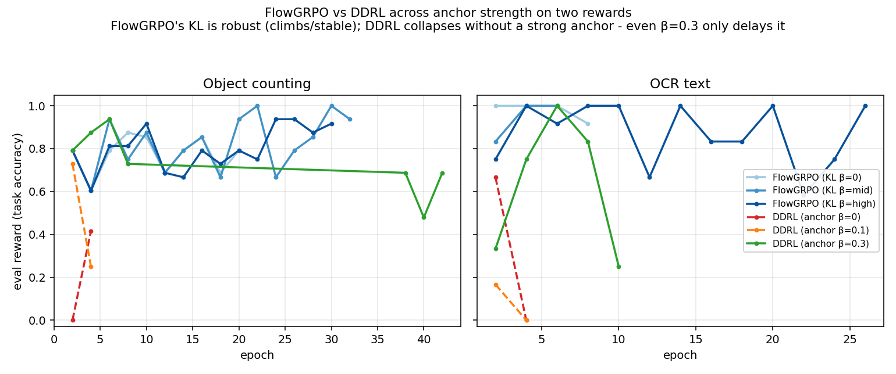
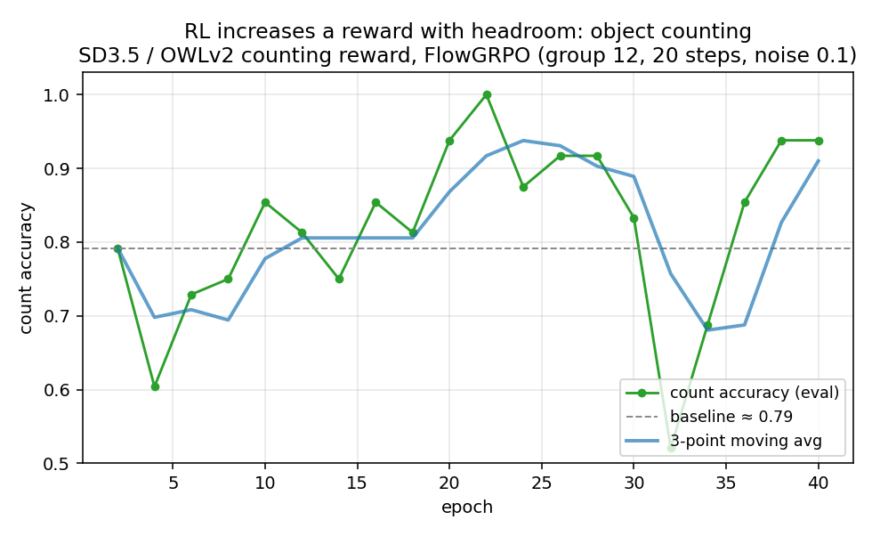
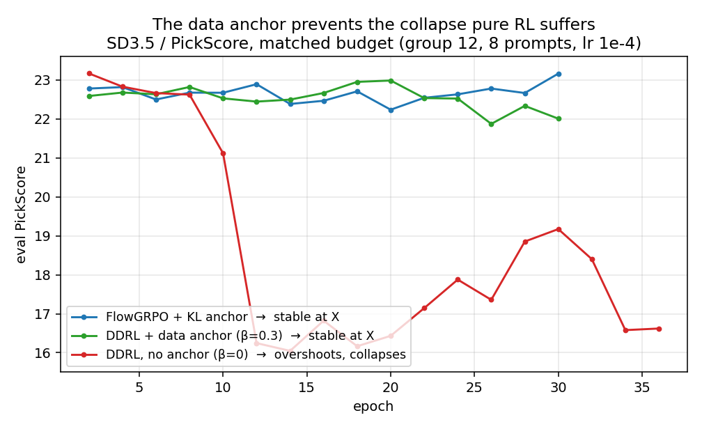

# Reproduction report

All runs on **Stable Diffusion 3.5-Medium** (FLUX where noted), LoRA rank 16, bf16,
on Stanford cluster A5000/A6000-Ada GPUs. Every result below is a real training
run with the optimized metric tracked across epochs, not a smoke test. "Validated"
means a run reproduced the expected convergence behavior on hardware.

## Headline

The single most useful finding: **RL post-training increases a reward exactly
when the task has headroom, and stays flat when the base model is already near
that reward's ceiling.** This is not a bug or a tuning failure, it is a property
of the reward/model pairing, and it explains everything below.

- Rewards with headroom climb: OCR (to 1.0), object counting (0.79 to ~1.0),
  CLIP-score (27 to 29), aesthetic under DRaFT (5.9 to 9.6).
- Rewards where SD3.5 is already strong stay flat: PickScore (~22.5), HPS-v2
  (~0.28). SD3.5 is near their ceiling, so there is nothing to push up.

This directly answers the earlier question of why PickScore would not move: it was
the wrong reward to demonstrate an increase on, not a broken method.

## Trainers

| Trainer | Task / reward | Result | Status |
|---------|---------------|--------|--------|
| **FlowGRPO** | OCR, counting, CLIP-score | OCR to 1.0; counting 0.79 to ~1.0; CLIP 27 to 29 | **validated**, robust workhorse |
| **DRaFT** | aesthetic (LAION) | 5.9 to 9.6 | **validated** |
| **DDRL** | counting / OCR + data anchor | climbs with an anchor; collapses without one (see grid) | **validated with anchor** |
| **SFT** | Naruto denoising | flow-matching loss healthy, converges | **validated** |
| **DiffusionDPO** | preference pairs | winner/loser separation learned | **validated** (re-run currently blocked by Pick-a-Pic dataset gating) |
| **DDPO/DPOK** | counting / OCR | ratio ~1.0 and gradients flow, but reward does not reliably climb: counting degraded 0.34 to 0.10, OCR net-flat | **tested, genuinely weak** |

DDPO is the one trainer that does not reliably improve rewards even on a headroom
task with the fixed config. This is an algorithmic limitation (PPO without GRPO's
group-relative advantage), not a code bug: the importance ratio is corrected and
gradients reach the LoRA params.

## Comprehensive grid: algorithms x anchor strength x reward

The rigorous comparison: FlowGRPO vs DDRL, each at anchor beta in {0, mid, high},
on two headroom rewards (counting and OCR), matched budget (group 12, 20 rollout
steps, noise 0.1, lr 1e-4).

| reward | algorithm | beta=0 | beta=mid | beta=high |
|--------|-----------|--------|----------|-----------|
| counting | FlowGRPO (KL) | climb 0.79->0.88 | climb ->1.00 | climb ->0.94 |
| counting | DDRL (data) | **collapse** | **collapse** | climbs to 0.94 then drifts down |
| OCR | FlowGRPO (KL) | ->1.00 | climb ->1.00 | climb ->1.00 |
| OCR | DDRL (data) | **collapse ->0** | **collapse ->0** | climbs to 1.00 then **collapses ->0.25** |

Reading of the grid:

1. **FlowGRPO's KL anchor is robust.** It climbs or holds high at every beta, on
   both rewards, for the full run. It never collapses.
2. **DDRL's data anchor is real but weaker.** With beta = 0 or too small, the
   policy overshoots and collapses toward 0. A stronger anchor (0.3) lets it climb
   first, but does not fully prevent collapse over a longer run: on OCR it crashes
   back after peaking, on counting it drifts down. So DDRL needs a larger data_beta
   (or a task-matched anchor set) than one might expect, and at these settings the
   KL anchor is the more stable of the two.

This confirms the anchor intuition directionally (no anchor -> collapse; anchor
-> the run survives longer and can climb) while being honest that the data anchor
at beta=0.3 only delays collapse rather than eliminating it.

## The reward-increase result on a headroom task

The clearest single demonstration that RL increases a reward when there is room to
improve: FlowGRPO on an object-counting reward (does the image contain the right
number of objects, scored with an open-vocabulary detector).

Count accuracy climbs from ~0.79 to a peak of 1.0, holding around 0.9. One
practical lesson worth passing on: a detector-based reward needs the rollout images
to be coherent. At the short, high-noise sampling that works for PickScore, the
images were too rough for the detector to find any objects, the reward was flat
zero, and nothing trained. Raising the sampling steps (10 to 20) and lowering the
exploration noise fixed it. There is a real tension between wanting exploration
noise for the RL and wanting clean images for a strict reward.

## DDRL data anchor vs collapse

The isolated anchor result (matched budget, PickScore): FlowGRPO stable, DDRL
without anchor overshoots and collapses, DDRL with a small anchor stays stable.

## FLUX.1-schnell

The FLUX code path (model auto-detection, packed 3D latents, sample/replay with
log-probs, schnell guidance gating, decode) runs end-to-end with FlowGRPO +
aesthetic on a 48GB A6000-Ada. Convergence is modest and noisy: schnell is a
4-step distilled model not built for stochastic SDE sampling, and its
sampling/replay ratio sits ~0.92 vs ~1.0 on SD3. Status: **code path validated on
FLUX, convergence weak on schnell.** FLUX.1-dev (non-distilled) would be a better
RL target and has not been run.

## Bugs found and fixed during this work

All fixed; every result above is on the corrected code.

1. **One optimizer step per epoch.** The RL trainers accumulated the whole batch
   into a single update, so even a long run did only a few dozen steps. Rewritten
   to step per mini-batch, which is what actually let the reward move.
2. **Importance-ratio bias at the last denoising step.** Training the final
   near-zero-noise step made the sampling-vs-training ratio ~0.92 instead of ~1.0.
   Dropping that step (timestep_fraction) fixed it.
3. **DRaFT never trained.** autocast's weight cache stored a detached bf16 cast of
   the LoRA weights in a no_grad warmup, so no gradient reached them. Fixed with
   cache_enabled=False (aesthetic then 5.9 to 9.6).
4. **VAE decode/encode range** (repo-wide): decode returned [-1,1] but was clamped
   to [0,1] without /2+0.5, crushing 55% of every image to black; encode fed [0,1]
   to a VAE expecting [-1,1]. Both fixed.
5. **Memory:** the rollout trajectory was kept alive into the next epoch's sampling
   (doubling peak memory), and the VAE decoded a whole sample group at once. Freed
   per epoch and chunked the decode.
6. Smaller fixes: precision-aligned sampling/replay, PEFT disable_adapters API,
   PickScore/OCR/count reward APIs across transformers versions, GRPO-guard
   stop-grad, and the noise/KL interaction (low noise inflates the KL penalty
   ~1/noise^2, which silently over-weights the anchor and freezes the policy).

## Limitations and honest gaps

- Eval curves use a small number of prompts and are noisy; read the trend, not any
  single point.
- DDPO does not reliably improve rewards (weaker algorithm).
- DDRL's data anchor at beta=0.3 delays but does not fully prevent collapse; a
  larger anchor or task-matched anchor images are likely needed.
- DiffusionDPO re-run is blocked by Pick-a-Pic HF gating (dataset access).
- FLUX.1-dev not run; schnell is a poor SDE-RL target.

See `report/GRID_RESULTS.md` and `VALIDATION.md` for the per-cell data and the full
trainer/reward matrix. Figures regenerate from `report/make_*.py` and the CSVs in
`report/grid_csv/`.
